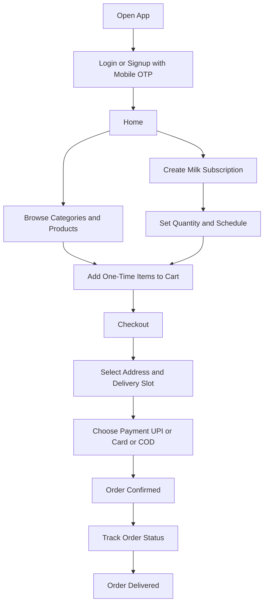
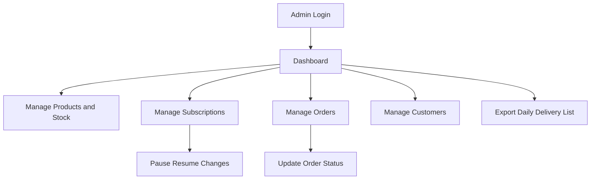

# User Flow Diagrams

## Customer App Flow

```mermaid
flowchart TD
  A[Open App] --> B[Login or Signup with Mobile OTP]
  B --> C[Home]
  C --> D[Browse Categories and Products]
  C --> E[Create Milk Subscription]
  D --> F[Add One-Time Items to Cart]
  E --> G[Set Quantity and Schedule]
  G --> F
  F --> H[Checkout]
  H --> I[Select Address and Delivery Slot]
  I --> J[Choose Payment UPI or Card or COD]
  J --> K[Order Confirmed]
  K --> L[Track Order Status]
  L --> M[Order Delivered]
```

## Admin Operations Flow

```mermaid
flowchart TD
  A[Admin Login] --> B[Dashboard]
  B --> C[Manage Products and Stock]
  B --> D[Manage Subscriptions]
  B --> E[Manage Orders]
  B --> F[Manage Customers]
  E --> G[Update Order Status]
  D --> H[Pause Resume Changes]
  B --> I[Export Daily Delivery List]
```
